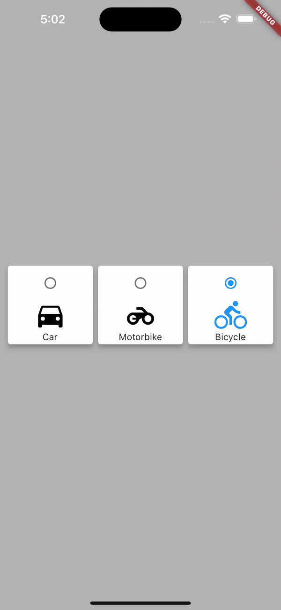

# Flutter Radio Button Card Widget

Welcome to the Flutter Radio Button Card Widget repository. This is a highly customizable Flutter widget that allows developers to implement a radio button selection within individual cards. This widget could be useful in many scenarios where an app requires users to make a selection from a set of options.

## Widget Overview

The widget is a `Card` widget containing a `Column` widget, which encapsulates a `Radio` button, an `Icon` widget, and a `Text` widget respectively. This widget allows users to select a specific option by tapping the corresponding radio button.

The widget comes with the functionality to highlight the selected option by changing the color of the icon and the border of the card when an option is selected.

## Features

- Highly customizable: You can easily change the icons, text, and colors according to your preference.
- User-friendly: A visual change to the selected option aids users to easily identify their current selection.
- Scalable: You can easily add more options by following the provided structure.

## Installation

You can incorporate this widget into your Flutter app by cloning this repository into your project folder. Then, simply import the required Dart file to use the widget.

## Usage

To use this widget, you should create an instance of the `TransportationSelection` widget and place it in the appropriate location in your widget tree.

## Demo

We hope you find this widget helpful for your Flutter development. We appreciate your star, and feel free to contribute!

